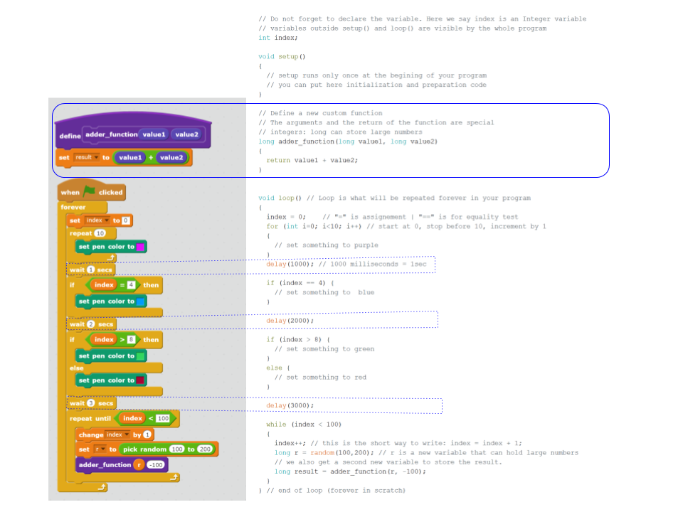

# Scratch Code to Arduino Code

This is a simple cheat sheet showing the equivalences between Scratch blocks
and Arduiono code.

The hope was to help a kid to start programming an Arduino board by using his
previous knowledge of Scratch. The kid in question did not show much interest
in Arduino, so the effort to create a more complete guide stopped.

There is both a SVG and a PDF version of the mini guide (image below
just as an enticement).

